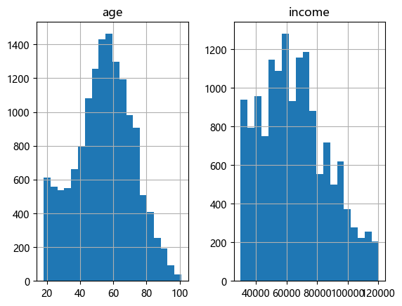
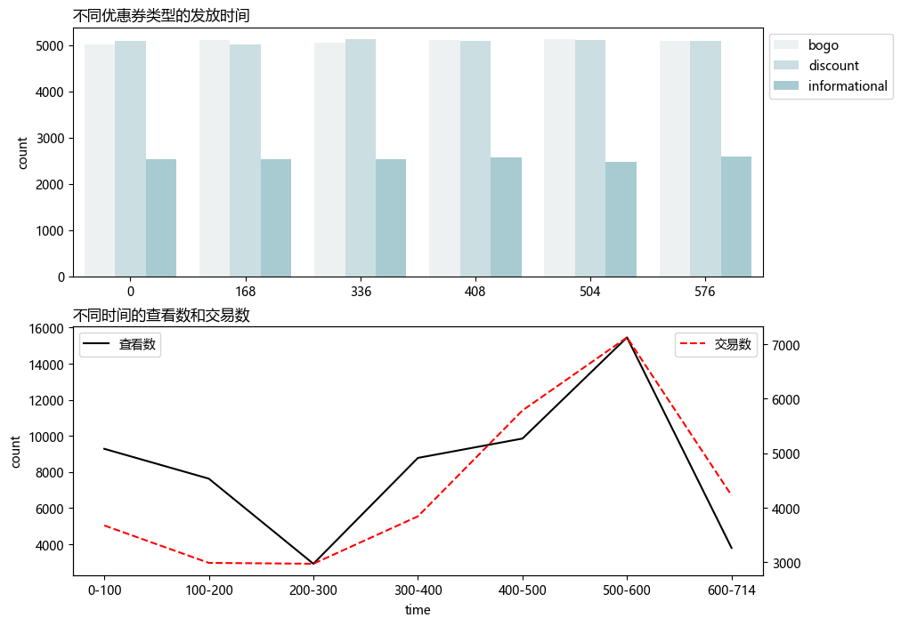
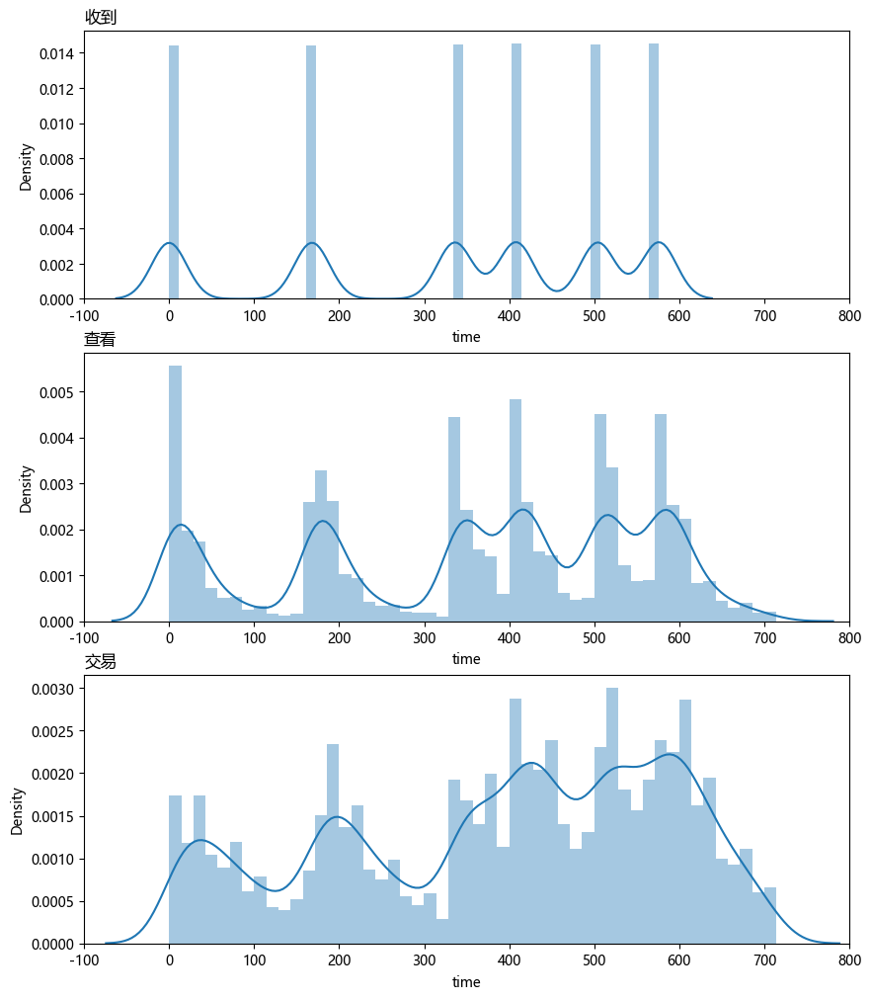
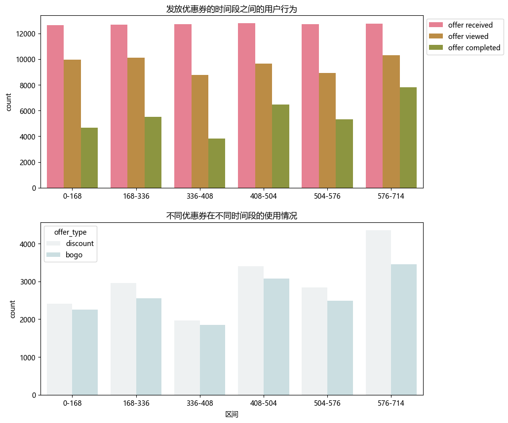
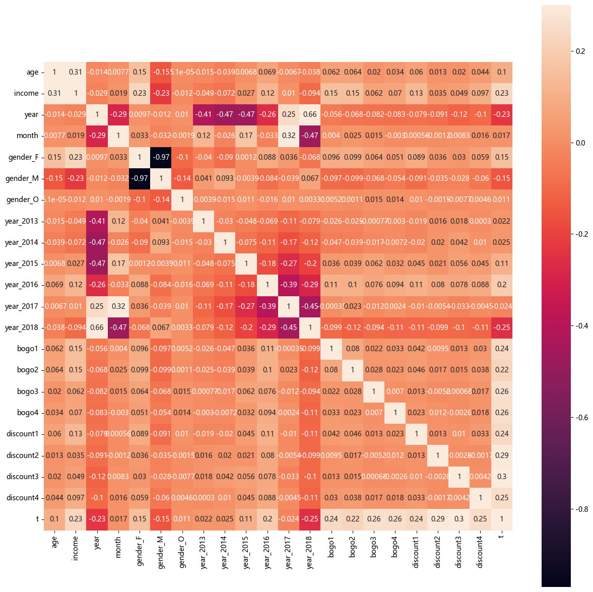
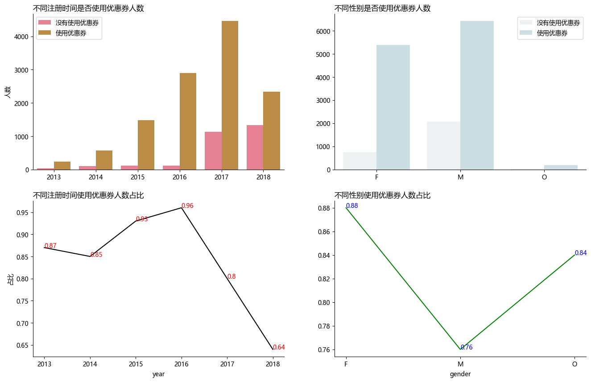
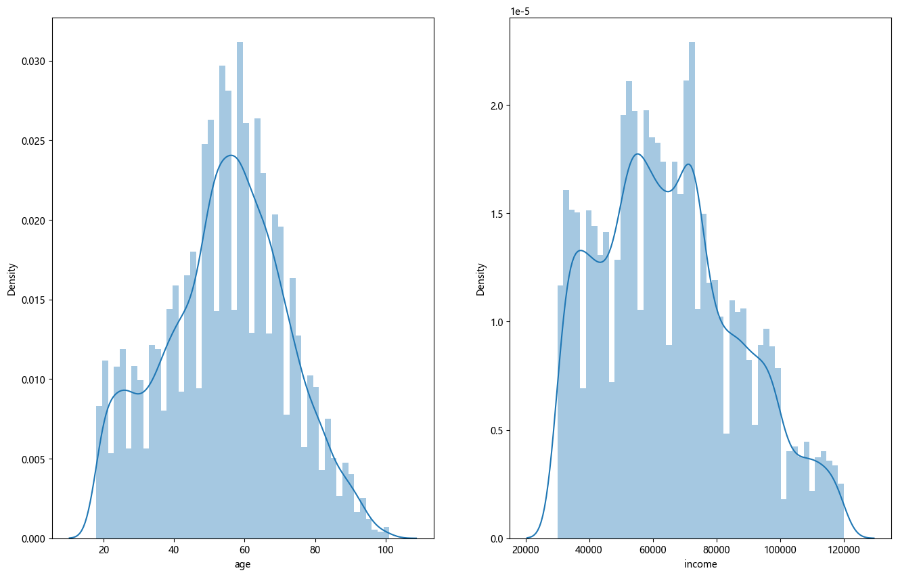
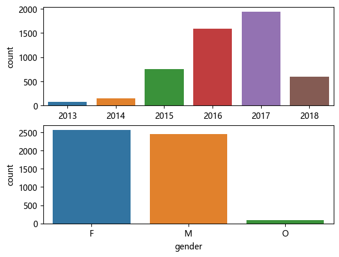
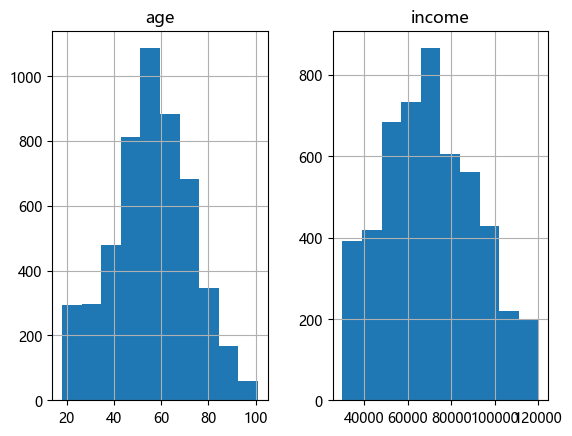

```python
!pip install pyecharts 
```

    Collecting pyecharts
      Obtaining dependency information for pyecharts from https://files.pythonhosted.org/packages/88/9c/213d7107634fb6629a932f9120ec78be04435eabd1b2bee482908ac9d648/pyecharts-2.0.4-py3-none-any.whl.metadata
      Downloading pyecharts-2.0.4-py3-none-any.whl.metadata (1.3 kB)
    Requirement already satisfied: jinja2 in c:\users\95459\anaconda3\lib\site-packages (from pyecharts) (3.1.2)
    Collecting prettytable (from pyecharts)
      Obtaining dependency information for prettytable from https://files.pythonhosted.org/packages/4d/81/316b6a55a0d1f327d04cc7b0ba9d04058cb62de6c3a4d4b0df280cbe3b0b/prettytable-3.9.0-py3-none-any.whl.metadata
      Downloading prettytable-3.9.0-py3-none-any.whl.metadata (26 kB)
    Collecting simplejson (from pyecharts)
      Obtaining dependency information for simplejson from https://files.pythonhosted.org/packages/b6/8e/3e12d122dfdf549a8d12eaf39954ee39f2027060aa38b63430f8ab3244e7/simplejson-3.19.2-cp311-cp311-win_amd64.whl.metadata
      Downloading simplejson-3.19.2-cp311-cp311-win_amd64.whl.metadata (3.2 kB)
    Requirement already satisfied: MarkupSafe>=2.0 in c:\users\95459\anaconda3\lib\site-packages (from jinja2->pyecharts) (2.1.1)
    Requirement already satisfied: wcwidth in c:\users\95459\anaconda3\lib\site-packages (from prettytable->pyecharts) (0.2.5)
    Downloading pyecharts-2.0.4-py3-none-any.whl (147 kB)
       ---------------------------------------- 0.0/147.7 kB ? eta -:--:--
       ---------------------------------------- 0.0/147.7 kB ? eta -:--:--
       -- ------------------------------------- 10.2/147.7 kB ? eta -:--:--
       ---------------- ----------------------- 61.4/147.7 kB 1.6 MB/s eta 0:00:01
       -------------------------------------- - 143.4/147.7 kB 1.7 MB/s eta 0:00:01
       -------------------------------------- - 143.4/147.7 kB 1.7 MB/s eta 0:00:01
       -------------------------------------- 147.7/147.7 kB 974.8 kB/s eta 0:00:00
    Downloading prettytable-3.9.0-py3-none-any.whl (27 kB)
    Downloading simplejson-3.19.2-cp311-cp311-win_amd64.whl (75 kB)
       ---------------------------------------- 0.0/75.3 kB ? eta -:--:--
       -------------------------------- ------- 61.4/75.3 kB 1.6 MB/s eta 0:00:01
       -------------------------------- ------- 61.4/75.3 kB 1.6 MB/s eta 0:00:01
       -------------------------------- ------- 61.4/75.3 kB 1.6 MB/s eta 0:00:01
       -------------------------------- ------- 61.4/75.3 kB 1.6 MB/s eta 0:00:01
       -------------------------------- ------- 61.4/75.3 kB 1.6 MB/s eta 0:00:01
       -------------------------------- ------- 61.4/75.3 kB 1.6 MB/s eta 0:00:01
       -------------------------------- ------- 61.4/75.3 kB 1.6 MB/s eta 0:00:01
       -------------------------------- ------- 61.4/75.3 kB 1.6 MB/s eta 0:00:01
       -------------------------------- ------- 61.4/75.3 kB 1.6 MB/s eta 0:00:01
       ---------------------------------------- 75.3/75.3 kB 180.8 kB/s eta 0:00:00
    Installing collected packages: simplejson, prettytable, pyecharts
    Successfully installed prettytable-3.9.0 pyecharts-2.0.4 simplejson-3.19.2
    


```python
# 导入所需的库
import pandas as pd
from pandas.io.json import json_normalize
import matplotlib.pyplot as plt
import numpy as np
import seaborn as sns
import os
import json
import warnings 
from pyecharts.charts import Boxplot,Pie, Bar, Grid, Line,Page,Funnel
from pyecharts import options as opts
from pyecharts.commons.utils import JsCode
import pyecharts
warnings.filterwarnings("ignore")
plt.rcParams['font.sans-serif'] =['Microsoft YaHei'] # 用来正常显示中文标签
plt.rcParams['axes.unicode_minus']=False  # 用来正常显示负号
print(pyecharts.__version__)
```

    2.0.4
    


```python
pd.set_option('display.max_columns',1000)
pd.set_option('display.width', 1000)
pd.set_option('display.max_colwidth',1000)
```


```python
# 读取数据
path1 = "./portfolio.json"
path2 = "./profile.json"
path3 = "./transcript.json"

portfolio = pd.read_json(path1,orient="records",lines=True)
profile = pd.read_json(path2,orient="records",lines=True)
transcript = pd.read_json(path3,orient="records",lines=True)
```

# 优惠券表数据处理


```python
portfolio.sort_values(["offer_type"],inplace=True)
portfolio.reset_index(drop=True)
```


<div>
<style scoped>
    .dataframe tbody tr th:only-of-type {
        vertical-align: middle;
    }

    .dataframe tbody tr th {
        vertical-align: top;
    }

    .dataframe thead th {
        text-align: right;
    }
</style>
<table border="1" class="dataframe">
  <thead>
    <tr style="text-align: right;">
      <th></th>
      <th>reward</th>
      <th>channels</th>
      <th>difficulty</th>
      <th>duration</th>
      <th>offer_type</th>
      <th>id</th>
    </tr>
  </thead>
  <tbody>
    <tr>
      <th>0</th>
      <td>10</td>
      <td>[email, mobile, social]</td>
      <td>10</td>
      <td>7</td>
      <td>bogo</td>
      <td>ae264e3637204a6fb9bb56bc8210ddfd</td>
    </tr>
    <tr>
      <th>1</th>
      <td>10</td>
      <td>[web, email, mobile, social]</td>
      <td>10</td>
      <td>5</td>
      <td>bogo</td>
      <td>4d5c57ea9a6940dd891ad53e9dbe8da0</td>
    </tr>
    <tr>
      <th>2</th>
      <td>5</td>
      <td>[web, email, mobile]</td>
      <td>5</td>
      <td>7</td>
      <td>bogo</td>
      <td>9b98b8c7a33c4b65b9aebfe6a799e6d9</td>
    </tr>
    <tr>
      <th>3</th>
      <td>5</td>
      <td>[web, email, mobile, social]</td>
      <td>5</td>
      <td>5</td>
      <td>bogo</td>
      <td>f19421c1d4aa40978ebb69ca19b0e20d</td>
    </tr>
    <tr>
      <th>4</th>
      <td>5</td>
      <td>[web, email]</td>
      <td>20</td>
      <td>10</td>
      <td>discount</td>
      <td>0b1e1539f2cc45b7b9fa7c272da2e1d7</td>
    </tr>
    <tr>
      <th>5</th>
      <td>3</td>
      <td>[web, email, mobile, social]</td>
      <td>7</td>
      <td>7</td>
      <td>discount</td>
      <td>2298d6c36e964ae4a3e7e9706d1fb8c2</td>
    </tr>
    <tr>
      <th>6</th>
      <td>2</td>
      <td>[web, email, mobile, social]</td>
      <td>10</td>
      <td>10</td>
      <td>discount</td>
      <td>fafdcd668e3743c1bb461111dcafc2a4</td>
    </tr>
    <tr>
      <th>7</th>
      <td>2</td>
      <td>[web, email, mobile]</td>
      <td>10</td>
      <td>7</td>
      <td>discount</td>
      <td>2906b810c7d4411798c6938adc9daaa5</td>
    </tr>
    <tr>
      <th>8</th>
      <td>0</td>
      <td>[web, email, mobile]</td>
      <td>0</td>
      <td>4</td>
      <td>informational</td>
      <td>3f207df678b143eea3cee63160fa8bed</td>
    </tr>
    <tr>
      <th>9</th>
      <td>0</td>
      <td>[email, mobile, social]</td>
      <td>0</td>
      <td>3</td>
      <td>informational</td>
      <td>5a8bc65990b245e5a138643cd4eb9837</td>
    </tr>
  </tbody>
</table>
</div>


**可以看出，有三种优惠券的类型，十种不同的形式的优惠券**


```python
# 将优惠券分类
portfolio['id_'] = ['bogo1','bogo2','bogo3','bogo4','discount1','discount2','discount3','discount4','informational1','informational2']
```


```python
portfolio.rename(columns={'id':"offer_id"},inplace=True)
portfolio
```


<div>
<style scoped>
    .dataframe tbody tr th:only-of-type {
        vertical-align: middle;
    }

    .dataframe tbody tr th {
        vertical-align: top;
    }

    .dataframe thead th {
        text-align: right;
    }
</style>
<table border="1" class="dataframe">
  <thead>
    <tr style="text-align: right;">
      <th></th>
      <th>reward</th>
      <th>channels</th>
      <th>difficulty</th>
      <th>duration</th>
      <th>offer_type</th>
      <th>offer_id</th>
      <th>id_</th>
    </tr>
  </thead>
  <tbody>
    <tr>
      <th>0</th>
      <td>10</td>
      <td>[email, mobile, social]</td>
      <td>10</td>
      <td>7</td>
      <td>bogo</td>
      <td>ae264e3637204a6fb9bb56bc8210ddfd</td>
      <td>bogo1</td>
    </tr>
    <tr>
      <th>1</th>
      <td>10</td>
      <td>[web, email, mobile, social]</td>
      <td>10</td>
      <td>5</td>
      <td>bogo</td>
      <td>4d5c57ea9a6940dd891ad53e9dbe8da0</td>
      <td>bogo2</td>
    </tr>
    <tr>
      <th>3</th>
      <td>5</td>
      <td>[web, email, mobile]</td>
      <td>5</td>
      <td>7</td>
      <td>bogo</td>
      <td>9b98b8c7a33c4b65b9aebfe6a799e6d9</td>
      <td>bogo3</td>
    </tr>
    <tr>
      <th>8</th>
      <td>5</td>
      <td>[web, email, mobile, social]</td>
      <td>5</td>
      <td>5</td>
      <td>bogo</td>
      <td>f19421c1d4aa40978ebb69ca19b0e20d</td>
      <td>bogo4</td>
    </tr>
    <tr>
      <th>4</th>
      <td>5</td>
      <td>[web, email]</td>
      <td>20</td>
      <td>10</td>
      <td>discount</td>
      <td>0b1e1539f2cc45b7b9fa7c272da2e1d7</td>
      <td>discount1</td>
    </tr>
    <tr>
      <th>5</th>
      <td>3</td>
      <td>[web, email, mobile, social]</td>
      <td>7</td>
      <td>7</td>
      <td>discount</td>
      <td>2298d6c36e964ae4a3e7e9706d1fb8c2</td>
      <td>discount2</td>
    </tr>
    <tr>
      <th>6</th>
      <td>2</td>
      <td>[web, email, mobile, social]</td>
      <td>10</td>
      <td>10</td>
      <td>discount</td>
      <td>fafdcd668e3743c1bb461111dcafc2a4</td>
      <td>discount3</td>
    </tr>
    <tr>
      <th>9</th>
      <td>2</td>
      <td>[web, email, mobile]</td>
      <td>10</td>
      <td>7</td>
      <td>discount</td>
      <td>2906b810c7d4411798c6938adc9daaa5</td>
      <td>discount4</td>
    </tr>
    <tr>
      <th>2</th>
      <td>0</td>
      <td>[web, email, mobile]</td>
      <td>0</td>
      <td>4</td>
      <td>informational</td>
      <td>3f207df678b143eea3cee63160fa8bed</td>
      <td>informational1</td>
    </tr>
    <tr>
      <th>7</th>
      <td>0</td>
      <td>[email, mobile, social]</td>
      <td>0</td>
      <td>3</td>
      <td>informational</td>
      <td>5a8bc65990b245e5a138643cd4eb9837</td>
      <td>informational2</td>
    </tr>
  </tbody>
</table>
</div>


# 用户表数据处理


```python
# 查看数据
profile.info()
```

    <class 'pandas.core.frame.DataFrame'>
    RangeIndex: 17000 entries, 0 to 16999
    Data columns (total 5 columns):
     #   Column            Non-Null Count  Dtype  
    ---  ------            --------------  -----  
     0   gender            14825 non-null  object 
     1   age               17000 non-null  int64  
     2   id                17000 non-null  object 
     3   became_member_on  17000 non-null  int64  
     4   income            14825 non-null  float64
    dtypes: float64(1), int64(2), object(2)
    memory usage: 664.2+ KB
    


```python
# 对缺失值进行处理，先查看缺失值的数据是怎样的
gender_null = profile.loc[profile.gender.isnull()]
gender_null.shape
```


    (2175, 5)


```python
income_null = profile.loc[profile.income.isnull()]
pd.merge(gender_null,income_null,on='id').shape
```


    (2175, 9)


```python
# 通过对两个缺失值的DataDrame取交集，得到的行数还是不变，说明表中的缺失值都是同一行，因为收入较难填充，所以将这些行删除
profile = profile.loc[~profile.income.isnull()].reset_index(drop=True)
profile.info()
```

    <class 'pandas.core.frame.DataFrame'>
    RangeIndex: 14825 entries, 0 to 14824
    Data columns (total 5 columns):
     #   Column            Non-Null Count  Dtype  
    ---  ------            --------------  -----  
     0   gender            14825 non-null  object 
     1   age               14825 non-null  int64  
     2   id                14825 non-null  object 
     3   became_member_on  14825 non-null  int64  
     4   income            14825 non-null  float64
    dtypes: float64(1), int64(2), object(2)
    memory usage: 579.2+ KB
    


```python
# 更改数据类型
profile["became_member_on"] = pd.to_datetime(profile["became_member_on"].apply(lambda x :str(x)))
profile['year'] = profile["became_member_on"].dt.year
profile['month'] = profile["became_member_on"].dt.month
```


```python
# 查看用户表数据的分布
profile.describe().T
```


<div>
<style scoped>
    .dataframe tbody tr th:only-of-type {
        vertical-align: middle;
    }

    .dataframe tbody tr th {
        vertical-align: top;
    }

    .dataframe thead th {
        text-align: right;
    }
</style>
<table border="1" class="dataframe">
  <thead>
    <tr style="text-align: right;">
      <th></th>
      <th>count</th>
      <th>mean</th>
      <th>std</th>
      <th>min</th>
      <th>25%</th>
      <th>50%</th>
      <th>75%</th>
      <th>max</th>
    </tr>
  </thead>
  <tbody>
    <tr>
      <th>age</th>
      <td>14825.0</td>
      <td>54.393524</td>
      <td>17.383705</td>
      <td>18.0</td>
      <td>42.0</td>
      <td>55.0</td>
      <td>66.0</td>
      <td>101.0</td>
    </tr>
    <tr>
      <th>income</th>
      <td>14825.0</td>
      <td>65404.991568</td>
      <td>21598.299410</td>
      <td>30000.0</td>
      <td>49000.0</td>
      <td>64000.0</td>
      <td>80000.0</td>
      <td>120000.0</td>
    </tr>
    <tr>
      <th>year</th>
      <td>14825.0</td>
      <td>2016.620169</td>
      <td>1.198245</td>
      <td>2013.0</td>
      <td>2016.0</td>
      <td>2017.0</td>
      <td>2017.0</td>
      <td>2018.0</td>
    </tr>
    <tr>
      <th>month</th>
      <td>14825.0</td>
      <td>6.695582</td>
      <td>3.488853</td>
      <td>1.0</td>
      <td>4.0</td>
      <td>7.0</td>
      <td>10.0</td>
      <td>12.0</td>
    </tr>
  </tbody>
</table>
</div>


```python
profile[['age','income']].hist(bins=20)
```


    array([[<Axes: title={'center': 'age'}>,
            <Axes: title={'center': 'income'}>]], dtype=object)


    

    


**可以看到年龄的分布中，较多集中在42-75岁之间，而在收入的分布中，50000-75000的收入的人群最多**

# 交易记录表处理


```python
# 将记录中的值拆分出来
transcript_df = transcript.join(
    pd.DataFrame.from_records(transcript.pop('value')))
transcript_df.offer_id.update(transcript_df.pop('offer id'))
```


```python
t = pd.merge(transcript_df,portfolio,how="left",on='offer_id')
transcript_df = t.drop(['offer_id','channels'],axis=1)
```


```python
transaction = transcript_df.query("event=='transaction'")
completed = transcript_df.query("event=='offer completed'")
viewed = transcript_df.query("event=='offer viewed'")
received = transcript_df.query("event=='offer received'")
```


```python
# 对于在所有的交易记录中，没有使用优惠券的记录是reward为null的记录，发放优惠券的次数是offer received的次数
# 可以划分出使用优惠券的组和没有使用优惠券的组
# 划分的方法：对应每个用户来说，若该用户transaction记录的时间与offer completed的时间相同，这说明，这条transaction记录是使用了优惠券的
def c_time(x):
    return x.values

def get_tran(x):
    if x.t_time in x.c_time:
        return 1
    else:
        return 0

x = completed.groupby('person')["time"].apply(c_time)
x = x.reset_index()
transaction = pd.merge(transaction,x,how="left",on='person')
transaction.rename(columns={'time_x':'t_time','time_y':"c_time"},inplace=True)
transaction['t_cat'] = transaction[~transaction.c_time.isnull()].apply(get_tran,axis=1)
transaction['t_id'] = range(len(transaction))
transaction.rename(columns={"t_time":'time'},inplace=True)
transaction.t_cat.value_counts()
```


    0.0    87561
    1.0    30617
    Name: t_cat, dtype: int64


```python
# 区分出使用优惠券的记录和没有使用优惠券的记录
# t_cat的0,1,2分别代表，0,1的用户为使用过优惠券的用户
# 0 该条记录没有使用优惠券
# 1 该条记录使用了优惠券
# 2 该条记录的用户没有使用过优惠券
jilu = pd.merge(transaction.query("t_cat==1"),completed,how='left',on=['person','time'])
jilu = jilu.drop(['reward_x_x','reward_y_x','difficulty_x','duration_x','offer_type_x','id__x'],axis=1)
jilu2 = pd.merge(transaction[['person','event','time','amount','t_cat','t_id']],jilu[['t_id','reward_x_y','difficulty_y','duration_y','offer_type_y','id__y']],
                 how='left',on='t_id')
_transaction = jilu2.drop_duplicates('t_id')
_transaction.reset_index(drop=True,inplace=True)
_transaction.drop('t_id',axis=1,inplace=True)
_transaction.rename(columns={'reward_x_y':'reward','difficulty_y':'difficulty','duration_y':'duration',
                             'offer_type_y':'offer_type','id__y':'id'},inplace=True)
_transaction.t_cat.fillna(2,inplace=True) # 
_transaction
```


<div>
<style scoped>
    .dataframe tbody tr th:only-of-type {
        vertical-align: middle;
    }

    .dataframe tbody tr th {
        vertical-align: top;
    }

    .dataframe thead th {
        text-align: right;
    }
</style>
<table border="1" class="dataframe">
  <thead>
    <tr style="text-align: right;">
      <th></th>
      <th>person</th>
      <th>event</th>
      <th>time</th>
      <th>amount</th>
      <th>t_cat</th>
      <th>reward</th>
      <th>difficulty</th>
      <th>duration</th>
      <th>offer_type</th>
      <th>id</th>
    </tr>
  </thead>
  <tbody>
    <tr>
      <th>0</th>
      <td>02c083884c7d45b39cc68e1314fec56c</td>
      <td>transaction</td>
      <td>0</td>
      <td>0.83</td>
      <td>2.0</td>
      <td>NaN</td>
      <td>NaN</td>
      <td>NaN</td>
      <td>NaN</td>
      <td>NaN</td>
    </tr>
    <tr>
      <th>1</th>
      <td>9fa9ae8f57894cc9a3b8a9bbe0fc1b2f</td>
      <td>transaction</td>
      <td>0</td>
      <td>34.56</td>
      <td>1.0</td>
      <td>2.0</td>
      <td>10.0</td>
      <td>7.0</td>
      <td>discount</td>
      <td>discount4</td>
    </tr>
    <tr>
      <th>2</th>
      <td>54890f68699049c2a04d415abc25e717</td>
      <td>transaction</td>
      <td>0</td>
      <td>13.23</td>
      <td>0.0</td>
      <td>NaN</td>
      <td>NaN</td>
      <td>NaN</td>
      <td>NaN</td>
      <td>NaN</td>
    </tr>
    <tr>
      <th>3</th>
      <td>b2f1cd155b864803ad8334cdf13c4bd2</td>
      <td>transaction</td>
      <td>0</td>
      <td>19.51</td>
      <td>0.0</td>
      <td>NaN</td>
      <td>NaN</td>
      <td>NaN</td>
      <td>NaN</td>
      <td>NaN</td>
    </tr>
    <tr>
      <th>4</th>
      <td>fe97aa22dd3e48c8b143116a8403dd52</td>
      <td>transaction</td>
      <td>0</td>
      <td>18.97</td>
      <td>1.0</td>
      <td>2.0</td>
      <td>10.0</td>
      <td>10.0</td>
      <td>discount</td>
      <td>discount3</td>
    </tr>
    <tr>
      <th>...</th>
      <td>...</td>
      <td>...</td>
      <td>...</td>
      <td>...</td>
      <td>...</td>
      <td>...</td>
      <td>...</td>
      <td>...</td>
      <td>...</td>
      <td>...</td>
    </tr>
    <tr>
      <th>138948</th>
      <td>b3a1272bc9904337b331bf348c3e8c17</td>
      <td>transaction</td>
      <td>714</td>
      <td>1.59</td>
      <td>0.0</td>
      <td>NaN</td>
      <td>NaN</td>
      <td>NaN</td>
      <td>NaN</td>
      <td>NaN</td>
    </tr>
    <tr>
      <th>138949</th>
      <td>68213b08d99a4ae1b0dcb72aebd9aa35</td>
      <td>transaction</td>
      <td>714</td>
      <td>9.53</td>
      <td>2.0</td>
      <td>NaN</td>
      <td>NaN</td>
      <td>NaN</td>
      <td>NaN</td>
      <td>NaN</td>
    </tr>
    <tr>
      <th>138950</th>
      <td>a00058cf10334a308c68e7631c529907</td>
      <td>transaction</td>
      <td>714</td>
      <td>3.61</td>
      <td>0.0</td>
      <td>NaN</td>
      <td>NaN</td>
      <td>NaN</td>
      <td>NaN</td>
      <td>NaN</td>
    </tr>
    <tr>
      <th>138951</th>
      <td>76ddbd6576844afe811f1a3c0fbb5bec</td>
      <td>transaction</td>
      <td>714</td>
      <td>3.53</td>
      <td>0.0</td>
      <td>NaN</td>
      <td>NaN</td>
      <td>NaN</td>
      <td>NaN</td>
      <td>NaN</td>
    </tr>
    <tr>
      <th>138952</th>
      <td>c02b10e8752c4d8e9b73f918558531f7</td>
      <td>transaction</td>
      <td>714</td>
      <td>4.05</td>
      <td>2.0</td>
      <td>NaN</td>
      <td>NaN</td>
      <td>NaN</td>
      <td>NaN</td>
      <td>NaN</td>
    </tr>
  </tbody>
</table>
<p>138953 rows × 10 columns</p>
</div>


# 数据分析

## 1.时间维度分析
**(1 优惠券的发放，查看，购买时间分析**


```python
# 对于使用了优惠券的交易时间分布
time_transaction = _transaction.query("t_cat==1").time.values
time_viewed = transcript_df.query("event=='offer viewed'").time.values


bins2 = [-1,100,200,300,400,500,600,714]
time_cut2 = pd.cut(time_transaction,bins2,labels=["0-100","100-200","200-300","300-400","400-500","500-600","600-714"])
time_cut3 = pd.cut(time_viewed,bins2,labels=["0-100","100-200","200-300","300-400","400-500","500-600","600-714"])
time_cut2 = pd.DataFrame(pd.value_counts(time_cut2).sort_index()).reset_index()
time_cut3 = pd.DataFrame(pd.value_counts(time_cut3).sort_index()).reset_index()
time_cut3.columns = ["time",'count']
time_cut2.columns = ["time",'count']

# 对优惠券的发放时间进行分析,由于是否是informational优惠券产生的交易行为很难统计，所以只对information优惠券的查看情况进行分析
pal = sns.light_palette((210, 90, 60), input="husl")
pal2 =sns.color_palette("husl", 8)
figure = plt.figure(figsize=(10,8))
plt.subplot(211)
sns.countplot(x='time',hue='offer_type',data=received,palette=pal)
plt.title("不同优惠券类型的发放时间",loc='left')
plt.xlabel("")
plt.legend(bbox_to_anchor=(1,1))
plt.subplot(212)
ax1 = sns.lineplot(x='time',y='count',data=time_cut3,color='black',label="查看数")
plt.legend(loc="upper left")
ax2 =ax1.twinx()
ax2 = sns.lineplot(x='time',y='count',data=time_cut2,color='r',linestyle='--',markers=True,label='交易数')
ax2.set_ylabel("")
plt.title("不同时间的查看数和交易数",loc='left')
plt.show()
```


    

    


**整体来看，针对优惠券的发放，共有6次，每次发放的数量大致相同，其中BOGO和discount的数量相同，而information的数量较少。**

**对于不同时间的优惠券查看次数来说:**

- 在200-300的时间段内，查看次数最少，可能是因为在这个时间段内没有优惠券发放导致的。
- 从300-600的时间段内，查看次数不断上升，这可能是因为在这段时间内共有4次优惠券发放，且发放的间隔时间较短。
- 在500-600的时间段内，查看次数最多，这可能是因为在这个时间段内共有两次优惠券发放，且大多数优惠券在600时间点之前被查看。

**对于不同时间的优惠券交易次数来说:**

- 在0-300的时间段内，交易次数相差不大，且在这个时间段内有两次优惠券发放，但是这个时间段产生的交易数量较少，说明这个时间段发放的优惠券转化率可能较低。
- 从300-400的时间段内，交易次数增长很快，可能是因为在这个时间段有很多用户使用了优惠券。
- 与查看次数相同，在500-600的时间段内，有较多的人购买了商品。

**(2 对优惠券的区间再细分**


```python
figure = plt.figure(figsize=(10,12))
plt.subplot(311)
plt.title("收到",loc='left')
sns.distplot(received.time,bins=50)
plt.xlim(-100,800)
plt.subplot(312)
plt.title("查看",loc='left')
sns.distplot(transcript_df.query("event=='offer viewed'").time,bins=50,norm_hist=True)
plt.xlim(-100,800)
plt.subplot(313)
sns.distplot(_transaction.query("t_cat==1").time,bins=50)
plt.xlim(-100,800)
plt.title("交易",loc='left')
```


    Text(0.0, 1.0, '交易')


    

    


**对于时间区间段进行拆分，可以看出：**

- 在0时间点发放的优惠券，被查看的次数很多，但是产生的交易数量并不是特别多，因此0时间点发放的优惠券的转化率可能较低。
- 在168时间点发放的优惠券，被查看的次数有所减少，但是交易次数有所增加。
- 在336时间点发放的优惠券，查看人数下降，购买人数也减少。
- 在400时间点附近有较多的人购买，其中包括在366时间点发放的优惠券和408时间点发放的优惠券的购买人数较多。
- 在504和576时间点的交易次数也维持着较高的水平。

**(3 根据发放的时间对优惠券的转换率进行分析**


```python
bins = [-1,167,335,407,503,575,714]
v_r = pd.cut(transcript_df.time,bins,labels=["0-168","168-336","336-408","408-504","504-576","576-714"])
# bins2 = [-1,100,200,300,400,500,600,714]
# time_cut2 = pd.cut(transcript_df.time,bins2,labels=["0-100","100-200","200-300","300-400","400-500","500-600","600-714"])
transcript_df['区间'] = v_r
# transcript_df["qujian2"] = time_cut2

final_t = pd.merge(transcript_df,_transaction,how='left',on=('person','event','time','amount'))

figure = plt.figure(figsize=(10,10))
plt.subplot(211)
ax = sns.countplot(x='区间',hue='event',data=transcript_df.query("event!='transaction'"),palette=pal2)
ax.set_title("发放优惠券的时间段之间的用户行为")
plt.legend(bbox_to_anchor=(1,1))
ax.set_xlabel("")
# ax2 = sns.catplot(x='qujian',hue='offer_type',data=transcript_df.query("event=='offer completed'"),palette=pal,kind='count')
plt.subplot(212)
ax2 = sns.countplot(x='区间',hue='offer_type',data=transcript_df.query("event=='offer completed'"),palette=pal)
ax2.set_title("不同优惠券在不同时间段的使用情况")
plt.show()
```


    

    


从上图可以大致看出优惠券的转换率情况，对于整体的优惠券情况，336-408之间的购买率是最低的，且在这区间的查看率也较低，说明在336time发放的优惠券的用户群体，可能使用优惠券的概率较低
在576之后的优惠券使用情况较好，说明在这个区间的用户群体较为喜欢使用优惠券，由于504time和576之间的发放间隔较接近，所以可能在504发放的优惠券在576之后才使用

可能也是因为在400以后的time是处于一段比较特殊（节假日，周末，或者举办什么活动的时间等）的时间，所以这段时间的用户会较多的购买产品
综合来说，在后半段发放的优惠券有更多的人会选择购买，说明在后半段针对的用户是较为有效的

对比不同的优惠券来看：

- discount的优惠券购买的人数是比BOGO优惠券多的，且discount的优惠券查看的人数较少，bogo优惠券查看的人数较多，
- 说明在bogo优惠券的用户可能会更多的查看买一送一的产品是什么，所以针对bogo优惠券，可以增强对买一送一产品的筛选，找出哪种bogo优惠券产品是最受喜欢的

## 优惠券的收益分析

### 不同优惠券的使用频率，支付总金额，平均客单价分析


```python
profit = _transaction.query("t_cat==1")
profit2 = profit[profit['amount']<100] # 减少订单金额较大的用户的影响

# 对于种类的优惠券成交占比
BOGO_total = profit.query("offer_type == 'bogo'")['event'].count()
discount_total = profit.query("offer_type == 'discount'")['event'].count()

def zhanbi_(x):
    if x.id.__contains__('bogo'):
        return x.fre / BOGO_total
    else:
        return x.fre  / discount_total

coupon_c = profit2.groupby('id')[["event",'amount']].agg({"event":"count","amount":"sum"}).reset_index() 
coupons = ["bogo1",'bogo2','bogo3','bogo4','discount1','discount2','discount3','discount4']
user = [len(profit2.query(f"id=='{coupon}'")['person'].unique()) for coupon in coupons]
coupon_c['c_price'] = coupon_c['amount'] / user  # 平均客单价
coupon_c.rename(columns={'event':'fre'},inplace=True)  # 优惠券的使用次数
coupon_c['per'] = coupon_c.apply(zhanbi_,axis=1) # 在各自种类的优惠券中，占比是多少

# 各优惠券的转换率
coupon_c['viewed'] = viewed.query("offer_type != 'informational'").groupby("id_")['person'].count().values
coupon_c['received'] = received.query("offer_type != 'informational'").groupby("id_")['person'].count().values
coupon_c['r'] =1.00
coupon_c["r_to_v"] = round(coupon_c['viewed'] / coupon_c['received'],2)
coupon_c["v_to_c"] = round(coupon_c['fre'] / coupon_c['viewed'],2) 
coupon_c["r_to_c"] = round(coupon_c['fre'] / coupon_c['received'],2)
coupon_c

'''r_to_v代表接收到优惠券后，实际查看优惠券的比率。计算方式为viewed（查看优惠券的人数）/ received（接收到优惠券的人数）。

v_to_c代表查看优惠券后，实际完成购买的比率。计算方式为fre（完成购买的人数）/ viewed（查看优惠券的人数）。

r_to_c代表接收到优惠券后，实际完成购买的比率。计算方式为fre（完成购买的人数）/ received（接收到优惠券的人数）。'''
```


<div>
<style scoped>
    .dataframe tbody tr th:only-of-type {
        vertical-align: middle;
    }

    .dataframe tbody tr th {
        vertical-align: top;
    }

    .dataframe thead th {
        text-align: right;
    }
</style>
<table border="1" class="dataframe">
  <thead>
    <tr style="text-align: right;">
      <th></th>
      <th>id</th>
      <th>fre</th>
      <th>amount</th>
      <th>c_price</th>
      <th>per</th>
      <th>viewed</th>
      <th>received</th>
      <th>r</th>
      <th>r_to_v</th>
      <th>v_to_c</th>
      <th>r_to_c</th>
    </tr>
  </thead>
  <tbody>
    <tr>
      <th>0</th>
      <td>bogo1</td>
      <td>3292</td>
      <td>65670.15</td>
      <td>22.699672</td>
      <td>0.233293</td>
      <td>6716</td>
      <td>7658</td>
      <td>1.0</td>
      <td>0.88</td>
      <td>0.49</td>
      <td>0.43</td>
    </tr>
    <tr>
      <th>1</th>
      <td>bogo2</td>
      <td>2959</td>
      <td>59157.13</td>
      <td>22.787800</td>
      <td>0.209695</td>
      <td>7298</td>
      <td>7593</td>
      <td>1.0</td>
      <td>0.96</td>
      <td>0.41</td>
      <td>0.39</td>
    </tr>
    <tr>
      <th>2</th>
      <td>bogo3</td>
      <td>3916</td>
      <td>64905.68</td>
      <td>18.694032</td>
      <td>0.277514</td>
      <td>4171</td>
      <td>7677</td>
      <td>1.0</td>
      <td>0.54</td>
      <td>0.94</td>
      <td>0.51</td>
    </tr>
    <tr>
      <th>3</th>
      <td>bogo4</td>
      <td>3851</td>
      <td>62760.12</td>
      <td>18.361650</td>
      <td>0.272908</td>
      <td>7264</td>
      <td>7571</td>
      <td>1.0</td>
      <td>0.96</td>
      <td>0.53</td>
      <td>0.51</td>
    </tr>
    <tr>
      <th>4</th>
      <td>discount1</td>
      <td>3199</td>
      <td>65342.52</td>
      <td>22.879034</td>
      <td>0.193808</td>
      <td>2663</td>
      <td>7668</td>
      <td>1.0</td>
      <td>0.35</td>
      <td>1.20</td>
      <td>0.42</td>
    </tr>
    <tr>
      <th>5</th>
      <td>discount2</td>
      <td>4673</td>
      <td>71424.96</td>
      <td>17.518999</td>
      <td>0.283109</td>
      <td>7337</td>
      <td>7646</td>
      <td>1.0</td>
      <td>0.96</td>
      <td>0.64</td>
      <td>0.61</td>
    </tr>
    <tr>
      <th>6</th>
      <td>discount3</td>
      <td>4901</td>
      <td>77395.24</td>
      <td>18.219218</td>
      <td>0.296922</td>
      <td>7327</td>
      <td>7597</td>
      <td>1.0</td>
      <td>0.96</td>
      <td>0.67</td>
      <td>0.65</td>
    </tr>
    <tr>
      <th>7</th>
      <td>discount4</td>
      <td>3614</td>
      <td>63485.50</td>
      <td>19.870266</td>
      <td>0.218951</td>
      <td>4118</td>
      <td>7632</td>
      <td>1.0</td>
      <td>0.54</td>
      <td>0.88</td>
      <td>0.47</td>
    </tr>
  </tbody>
</table>
</div>


```python

x_data = ['bogo1','bogo2','bogo3','bogo4','discount1','discount2','discount3','discount4']
y1_data = [3292, 2959, 3916, 3851, 3199, 4673, 4901, 3614]
y2_data = [65670.15, 59157.13, 64905.68, 62760.12, 65342.52, 71424.96,77395.24, 63485.5 ]
y3_data = [22.69967162, 22.78780046, 18.69403226, 18.36165009, 22.87903361,17.51899926, 18.21921846, 19.87026604]
bar = (
    Bar()
    .add_xaxis(x_data)
    .add_yaxis(
        "订单数",
        y1_data, 
        yaxis_index=0,
        color="#d14a61", 
    )
    
    
    # y2
    .add_yaxis(
        "优惠券交易金额", 
        y2_data, 
        yaxis_index=1,
        color="#5793f3", 
    )
    .extend_axis(
        yaxis=opts.AxisOpts(
            name="销售额",
            type_="value", 
            min_=0,  
            max_=100000,  
            position="right",  
            axisline_opts=opts.AxisLineOpts(
                linestyle_opts=opts.LineStyleOpts(color="#d14a61")
            ),
            axislabel_opts=opts.LabelOpts(formatter="{value}"),
        )
    )

    .extend_axis(
        yaxis=opts.AxisOpts(
            type_="value",
            name="平均客单价",
            min_=0,
            max_=25,
            position="left",
            axisline_opts=opts.AxisLineOpts(
                linestyle_opts=opts.LineStyleOpts(color="#675bba")
            ),
            axislabel_opts=opts.LabelOpts(formatter="{value}"),
            splitline_opts=opts.SplitLineOpts(
                is_show=True, 
                linestyle_opts=opts.LineStyleOpts(opacity=1)
            ),
        )
    )
    
    
    .set_global_opts(
        yaxis_opts=opts.AxisOpts(
            name="优惠券交易次数",
            min_=0,
            max_=10000,
            position="right",
            offset=80, 
            axisline_opts=opts.AxisLineOpts(
                linestyle_opts=opts.LineStyleOpts(color="#5793f3")
            ),
            axislabel_opts=opts.LabelOpts(formatter="{value}"),
        ),
        title_opts=opts.TitleOpts(title="收益对比"),
        tooltip_opts=opts.TooltipOpts(trigger="axis", axis_pointer_type="cross"),
    )
)

# 折线图
line = (
    Line()
    .add_xaxis(x_data)
    .add_yaxis(
        "平均客单价",
        y3_data,
        yaxis_index=2,
        color="#675bba",
        label_opts=opts.LabelOpts(is_show=False),
    )
)


bar.overlap(line) 

# 并行多图
grid = Grid()
grid.add(
    bar, 
    
    opts.GridOpts(
        pos_left="5%",
        pos_right="20%"), 
        is_control_axis_index=True
        
        )
grid.render("grid_multi_yaxis.html")
grid.render_notebook()
import webbrowser
webbrowser.open("grid_multi_yaxis.html")


```


    True


**对于不同类别的优惠券：**

**BOGO类型：**

- BOGO3和BOGO4的优惠券转化率较高，一半以上的发放量会被使用，BOGO4优惠券会有更多的人查看，而BOGO3则只有一半的人会去查看。

**Discount类型：**

- 有一个异常的优惠券是Discount1优惠券，该优惠券使用的人数比没有查看的人数还多。这可能是因为数据记录时出现了遗漏或者大多数使用这个优惠券的人都是直接使用而不会去查看。同时，该优惠券也是转化率最低的一个。
- 转化率最高的是Discount3优惠券，同时也有着较高的查看率。该优惠券在Discount类型中的收益应该是最好的。同时，Discount2的优惠券也有不错的转化率。

## 用户分析

### 用户特征与成功交易的相关性


```python
# 对数据进行处理，更好的探究不同变量之间的关系
# 对于分类型变量采用热编码

user_ = profile.copy()
g_cat = user_['gender'].str.get_dummies().add_prefix('gender_')
user_.year = user_.year.apply(lambda x: str(x))
y_cat = user_['year'].str.get_dummies().add_prefix('year_')
user_ = pd.concat([user_,g_cat,y_cat],axis=1)
user_.rename(columns={'id':'person'},inplace=True)

customers = pd.merge(_transaction,user_,on='person')

```


```python
'''dict_user字典存储了每种优惠券对应的用户列表，通过循环遍历`coupons`列表中的每个优惠券，
使用`apply`函数将每个用户是否使用了对应的优惠券的信息存储到`user_`字典中。
如果用户使用了特定的优惠券，则将对应位置的值设为1，否则设为0。'''

dict_user = dict(bogo1 = _transaction.query("id=='bogo1'")['person'].unique(),
bogo2 = _transaction.query("id=='bogo2'")['person'].unique(),
bogo3 = _transaction.query("id=='bogo3'")['person'].unique(),
bogo4 = _transaction.query("id=='bogo4'")['person'].unique(),
discount1 = _transaction.query("id=='discount1'")['person'].unique(),
discount2 = _transaction.query("id=='discount2'")['person'].unique(),
discount3 = _transaction.query("id=='discount3'")['person'].unique(),
discount4 = _transaction.query("id=='discount4'")['person'].unique())

for i in coupons:
    user_[i] = user_['person'].apply(lambda x:1 if x in dict_user[i] else 0)
```


```python
user_['t'] = user_.iloc[:,-8:].apply((lambda x:1 if np.sum(x)>0 else 0),axis=1)
user_.year=user_.year.apply(lambda x:int(x))
corr = user_.corr()
figure = plt.figure(figsize=(15,15))
ax = sns.heatmap(corr, vmax=.3, square=True,annot=True)
```


    

    


**根据上图所示，可以观察到用户各项特征中，2018年注册的用户与是否使用优惠券进行交易呈微弱负相关，而2016年注册的用户呈微弱正相关。这表明，相对于2018年注册的用户，2016年注册的用户更可能倾向于使用优惠券。**

**在比较女性和男性与是否交易的相关系数时，可以发现女性与交易呈微弱正相关，而与男性呈微弱负相关，这表明女性可能会比男性更多地使用优惠券。**

### 不同注册时间的用户优惠券使用情况


```python
gender_index = list(user_.gender.value_counts().sort_values().index)
gender_values = list(user_.gender.value_counts().sort_values().values)
year_index = list(user_.year.value_counts().sort_values().index)
year_values = list(user_.year.value_counts().sort_values().values)
gender_index,gender_values,year_index,year_values
```


    (['O', 'F', 'M'],
     [212, 6129, 8484],
     [2013, 2014, 2015, 2016, 2018, 2017],
     [274, 662, 1597, 3024, 3669, 5599])


```python
c = (
    Pie()
    .add(
        "",
        [list(z) for z in zip(['O', 'F', 'M'], [212, 6129, 8484])],
        center=["25%", "50%"],
        radius=["30%", "65%"],
    )
    .add(
        "",
        [list(z) for z in zip([2013, 2014, 2015, 2016, 2018, 2017],[274, 662, 1597, 3024, 3669, 5599])],
        center=["75%", "50%"],
        radius=["30%", "65%"],
    )
    .set_global_opts(
        title_opts=opts.TitleOpts(title="性别和注册日期的分布"),
        legend_opts=opts.LegendOpts(orient="horizontal", pos_left="25%"),
    )
     .set_series_opts(label_opts=opts.LabelOpts(formatter="{b}: {c}"))
     .render("pie_radius.html")
)
webbrowser.open("pie_radius.html")
```


    True


**超过半数的用户是男性，这表明男性可能是主力用户群。同时，不同注册时间的用户中，2016年至2018年注册的用户数量最多。**

### 不同性别和不同注册时间的用户中使用优惠券的情况分析


```python
zhanbi_1 = round((user_.query("t==1").groupby('year')['person'].count() / user_.groupby('year')['person'].count()),2).reset_index()
zhanbi_2 = round((user_.query("t==1").groupby('gender')['person'].count() / user_.groupby('gender')['person'].count()),2).reset_index()

fig,axs= plt.subplots(2,2,figsize=(16,10))
for i in range(2):
    for j in range(2):
        axs[i][j].spines['top'].set_visible(False)
        axs[i][j].spines['right'].set_visible(False)

sns.countplot(x='year',hue='t',data=user_,palette=pal2,ax=axs[0][0])
sns.countplot(x='gender',data=user_,hue='t',palette=pal,ax=axs[0][1])
ax1 = sns.lineplot(x='year',y='person',data=zhanbi_1,color='black',ax=axs[1][0],markers=True)
ax2 = sns.lineplot(x='gender',y='person',data=zhanbi_2,color='g',ax=axs[1][1])


for i,z in zip(zhanbi_2.gender,zhanbi_2.person):
    ax2.text(i,z,z,fontsize=10,color='b')
for i,z in zip(zhanbi_1.year,zhanbi_1.person):
    ax1.text(i,z,z,fontsize=10,color='r')
axs[0][0].set_title("不同注册时间是否使用优惠券人数",loc='left')
axs[0][1].set_title("不同性别是否使用优惠券人数",loc='left')
axs[1][0].set_title("不同注册时间使用优惠券人数占比",loc='left')
axs[1][1].set_title("不同性别使用优惠券人数占比",loc='left')
axs[0][0].set_xlabel("")
axs[0][1].set_xlabel("")
axs[0][0].set_ylabel("人数")
axs[0][1].set_ylabel("")
axs[1][1].set_ylabel("")
axs[1][0].set_ylabel("占比")
axs[0][0].legend(['没有使用优惠券','使用优惠券'])
axs[0][1].legend(['没有使用优惠券','使用优惠券'])
```


    <matplotlib.legend.Legend at 0x1e478b06090>


    

    


根据上图可以得出以下结论：

- 在不同的年份中，2017年使用优惠券的用户人数最多，但在2017年注册的用户总数中占比较少。
- 在2018年注册的用户中，使用优惠券的人数占比最少，说明对于2018年注册的用户，发放优惠券的转换率较低。
- 在2017年之前注册的用户中，使用优惠券的人数占比较高，其中2016年的用户使用优惠券的比例最高，达到95%。同时，2016年的用户总数也较多。
- 因此，优惠券发放最优的用户是在2016年注册的用户。

对于不同性别的用户，男性用户的总人数更多，但使用优惠券的人数占比较低。相比之下，女性用户中使用优惠券的人数更多。

### 根据年龄和收入进行分析


```python
s_t = user_.query("t==1")
i=0
plt.figure(figsize=(16,10))
plt.subplot(121)
sns.distplot(user_.age,bins=50)
plt.subplot(122)
sns.distplot(user_.income,bins=50)
```


    <Axes: xlabel='income', ylabel='Density'>


    

    


```python
v_age =[]
v_income = []
for c in coupons:
    v1 = list(user_.query(f"{c}==1").age.values)
    v_age.append(v1)
    v2 = list(user_.query(f"{c}==1").income.values)
    v_income.append(v2)
```


```python
box = Boxplot()
x = box.prepare_data(v_age)
y = box.prepare_data(v_income)
box.add_xaxis(["age"])
box.add_yaxis("bogo1",[[18, 46.0, 57.0, 67.0, 100]],yaxis_index=0)
box.add_yaxis("bogo2",[[18, 47.0, 57.0, 68.0, 100]],yaxis_index=0)
box.add_yaxis("bogo3",[[18, 44, 56, 67, 101]],yaxis_index=0)
box.add_yaxis("bogo4",[[18, 44.0, 56.0, 67.0, 101]],yaxis_index=0)

box.add_yaxis("discount1",[[18, 47.0, 57.0, 68.0, 101]],yaxis_index=0)
box.add_yaxis("discount2",[[18, 43, 56, 67, 101]],yaxis_index=0)
box.add_yaxis("discount3",[[18, 43.0, 56.0, 66.0, 101]],yaxis_index=0)
box.add_yaxis("discount4",[[18, 45.0, 57, 67.0, 101]],yaxis_index=0)


box.set_global_opts(title_opts=opts.TitleOpts(title="BoxPlot-基本示例"))    
box.set_global_opts(
        yaxis_opts=opts.AxisOpts(
            name="年龄",
            min_=0,
            max_=120,
            position="left",
            axisline_opts=opts.AxisLineOpts(
                linestyle_opts=opts.LineStyleOpts(color="red")
            ),
            axislabel_opts=opts.LabelOpts(formatter="{value}"),
        ),
        title_opts=opts.TitleOpts(title="收益对比"),
    )
box.render('box_age.html')
box.render_notebook()
webbrowser.open("box_age.html")
```


    True


**对于不同的优惠券来说，年龄的分布基本相同，都是集中分布在45-67区间的用户中，从上图的直方图来看，在这个区间的用户数也是最多的，说明了星巴克的消费人群多是中年用户**


```python
box = Boxplot()
box.add_xaxis(["income"])
box.add_yaxis("bogo1",[[30000.0, 56000.0, 72000.0, 88000.0, 120000.0]],yaxis_index=0)
box.add_yaxis("bogo2",[[30000.0, 56000.0, 72000.0, 87000.0, 120000.0]],yaxis_index=0)
box.add_yaxis("bogo3",[[30000.0, 52000.0, 67000.0, 83000.0, 120000.0]],yaxis_index=0)
box.add_yaxis("bogo4",[[30000.0, 52000.0, 67000.0, 84000.0, 120000.0]],yaxis_index=0)

box.add_yaxis("discount1",[[30000.0, 55000.0, 71000.0, 87000.0, 120000.0]],yaxis_index=0)
box.add_yaxis("discount2",[[30000.0, 51000.0, 65000.0, 81000.0, 120000.0]],yaxis_index=0)
box.add_yaxis("discount3",[[30000.0, 51000.0, 66000.0, 82000.0, 120000.0]],yaxis_index=0)
box.add_yaxis("discount4",[[30000.0, 54000.0, 69000.0, 85000.0, 120000.0]],yaxis_index=0)


# box.add_yaxis("income",box.prepare_data([v3,v4]),yaxis_index=1)
box.set_global_opts(title_opts=opts.TitleOpts(title="BoxPlot-基本示例"))    
box.set_global_opts(
        yaxis_opts=opts.AxisOpts(
            name="收入",
            min_=0,
            max_=130000,
            position="left",
            axisline_opts=opts.AxisLineOpts(
                linestyle_opts=opts.LineStyleOpts(color="red")
            ),
            axislabel_opts=opts.LabelOpts(formatter="{value}"),
        ),
        title_opts=opts.TitleOpts(title="收益对比"),
    )
box.render('box_income.html')
box.render_notebook()
webbrowser.open("box_income.html")
```


    True


**收入的分布没有特别大的差别，大多使用了优惠券的用户的收入集中在50000~80000的收入之间，但是就平均数来说，bogo1,bogo2,discount1的用户平均收入高于其他使用优惠券的用户**

**结合年龄和收入一起来看，星巴克的用户多数是有较高的收入，同时年龄位于中年的中产用户，这些用户对星巴克的忠诚度应该相对较高，当对他们发送优惠券时，他们更加愿意去使用。**

### RFM模型分析


```python
# 利用RFM模型分析
# 其中R代表最近一次消费的时间
# F代表使用优惠券消费的次数
# M代表总共的消费金额

def RFM(x):
    level = str(x.R)+str(x.F)+str(x.M)
    if  level == '000':
        return '流失用户'
    elif level == '100':
        return '一般发展用户'
    elif level == '010':
        return '一般保持用户'
    elif level == '001':
        return '重要挽留用户'
    elif level == '110':
        return '一般价值用户'
    elif level == '101':
        return '重要发展用户'
    elif level == '011':
        return '重要保持用户'
    elif level == '111':
        return '高价值用户'
```


```python
# 计算每个用户的RFM
# 计算R：使用的是平均值
R = _transaction.groupby('person')['time'].max().reset_index()
R_mean = float(R.mean().values)
# 计算F:
# 对于使用优惠券的次数大于1次的用户设置为1
F = _transaction.query("t_cat==1").groupby('person')['event'].count().reset_index()
# 计算M,因为存在有较大的异常值，所以使用中位数
M = _transaction.groupby("person")['amount'].sum().reset_index()
M_median = float(M.median().values)

x1 = pd.merge(user_,R,how = 'left',on='person')
x2 = pd.merge(x1,F,how='left',on='person')
cc = pd.merge(x2,M,how='left',on='person')
cc.rename(columns={"time":'R','event':'F','amount':'M'},inplace=True)
cc.fillna(0,inplace=True)

cc.R = cc.R.apply(lambda x : 1 if x>R_mean else 0)
cc.F = cc.F.apply(lambda x : 1 if x>1 else 0)
cc.M = cc.M.apply(lambda x : 1 if x>M_median else 0)

cc['level'] = cc.apply(RFM,axis=1)
```


```python
c = (
    Pie()
    .add(
        "asva",
        [list(z) for z in zip(cc.level.value_counts().index, [25.33, 21.93, 19.93, 12.77,  8.89,  8.52,  1.95,  0.68])],
        radius=["30%", "75%"],
        center=["55%", "60%"],
        rosetype="area",
        label_opts=opts.LabelOpts(is_show=False),
    )
    .set_global_opts(
        title_opts=opts.TitleOpts(title="不同等级用户占比"),
        legend_opts=opts.LegendOpts(orient="horizontal", pos_left="25%"),
    )
    .set_series_opts(label_opts=opts.LabelOpts(formatter="{b}: {c}%"))
)

c.render('RMF.html')
webbrowser.open("RMF.html")

```


    True


```python
plt.subplot(211)
sns.countplot(x='year',data=cc.query("level=='高价值用户'"))
plt.subplot(212)
sns.countplot(x='gender',data=cc.query("level=='高价值用户'"))

cc.query("level=='高价值用户'")[['age','income']].hist()
```


    array([[<Axes: title={'center': 'age'}>,
            <Axes: title={'center': 'income'}>]], dtype=object)


    

    


    

    


```python
def get_data(x):
    data = cc.query(f"{x}==1").level.value_counts()
    return [list(z) for z in zip(data.index, round((data / data.sum()) *100,2).values)]

bogo1_data = get_data("bogo1")
bogo2_data = get_data("bogo2")
bogo3_data = get_data("bogo3")
bogo4_data = get_data("bogo4")
discount1_data = get_data("discount1")
discount2_data = get_data("discount2")
discount3_data = get_data("discount3")
discount4_data = get_data("discount4")
```


```python
fn = """
    function(params) {
        if(params.name == '高价值用户')
            return params.name + ' : ' + params.value + '%';
        if(params.name == '流失用户')
            return '\\n\\n\\n\\n' + params.name + ' : ' + params.value + '%';
        return '\\n\\n\\n\\n\\n\\n\\n' + params.seriesName
    }
    """

def new_label_opts():
    return opts.LabelOpts(formatter=JsCode(fn), position="center")

c = (
    Pie()
    .add(
        "bogo1",
#         [list(z) for z in zip(["剧情", "其他"], [25, 75])],
        bogo1_data,
        center=["20%", "30%"],
        radius=[60, 80],
        label_opts=new_label_opts(),
    )
    .add(
        "bogo2",
        bogo2_data,
        center=["55%", "30%"],
        radius=[60, 80],
        label_opts=new_label_opts(),
    )
    .add(
        "bogo3",
        bogo3_data,
        center=["20%", "70%"],
        radius=[60, 80],
        label_opts=new_label_opts(),
    )
    .add(
        "bogo4",
        bogo4_data,
        center=["55%", "70%"],
        radius=[60, 80],
        label_opts=new_label_opts(),
    )
    .set_global_opts(
        title_opts=opts.TitleOpts(title="bogo优惠券不同等级用户占比"),
        legend_opts=opts.LegendOpts(
            type_="scroll", pos_top="20%", pos_left="80%", orient="vertical"
        ),
    )
)
c.render('RMF_1.html')
webbrowser.open("RMF_1.html")

```


    True


**可以看出高价值用户较多的优惠券是bogo1和bogo2优惠券，可以增加对高价值的用户发放这些优惠券
对于流失用户比例来说，bogo3和bogo4使用的流失用户最多，所以可以向流失的用户更多的发放bogo3和bogo4优惠券**


```python

c = (
    Pie()
    .add(
        "discount1",
        discount1_data,
        center=["20%", "30%"],
        radius=[60, 80],
        label_opts=new_label_opts(),
    )
    .add(
        "discount2",
        discount2_data,
        center=["55%", "30%"],
        radius=[60, 80],
        label_opts=new_label_opts(),
    )
    .add(
        "discount3",
        discount3_data,
        center=["20%", "70%"],
        radius=[60, 80],
        label_opts=new_label_opts(),
    )
    .add(
        "discount4",
        discount4_data,
        center=["55%", "70%"],
        radius=[60, 80],
        label_opts=new_label_opts(),
    )
    .set_global_opts(
        title_opts=opts.TitleOpts(title="discount优惠券不同等级用户占比"),
        legend_opts=opts.LegendOpts(
            type_="scroll", pos_top="20%", pos_left="80%", orient="vertical"
        ),
    )
)

c.render('RMF_2.html')
webbrowser.open("RMF_2.html")

```


    True


可以看出对于每个不同的discount优惠券来说高价值用户占比最多的是discount1优惠券，且discount1优惠券的流失用户又是最少的，
所以在discount优惠券中应向高价值用户推广的优惠券是discount1
会使用discount3和discount2优惠券的流失用户较多，所以可以向流失用户更多的发放这些优惠券

总结：
用户在400time以后的时间，会更加多的去使用优惠券，所以可以增加优惠券发放的时间在400time以后的时间点,且在500~600time之间是用户使用优惠券最多的时间
bogo类型的bogo1优惠券是产生的交易额和平均客单价最高的优惠券，但是该优惠券的转换率低于其他的优惠券，可以更多的发放bogo1优惠券对目标用户，
discount类型的优惠券中discount3产生了更多的交易额，但是这个优惠券的平均客单价较低，可以向一些消费能力较低的用户更多得发放这个优惠券
对于2016年注册的用户中有98%的用户会使用优惠券，同时2015年的也有95%，但是2015的人数较少，所以应该加大对2016年的用户发放优惠券的力度
对于女性用户中有88%的用户会选择使用优惠券，但是总体人数较少，可以适当的增加女性用户的数量
结合RFM模型中高价值用户，最优的优惠券方案为：
向2016年注册，收入在70000左右的中年女性发放bogo1或者discount1，discount3优惠券


```python

```
